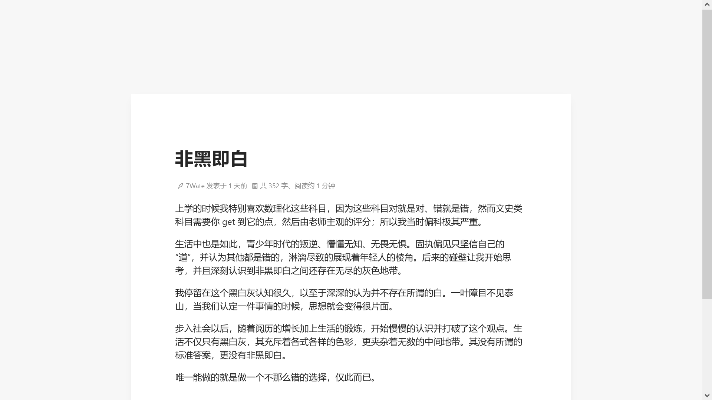

# halo-theme-Redemption

Redemption 一款专注阅读、写作的主题。

## 预览

- [7Wate's blog](https://blog.7wate.com/)

## 功能

**Halo 2.0 的底层架构变动，导致无法平滑升。目前仅支持 1.x 版本 🤝🤝🤝**

- [x] 专注阅读设计
- [x] 深 / 浅色模式
- [x] 全尺寸媒体自适应
- [x] Markdown 样式设计
- [x] 社交平台展示
- [x] 支持独立页面
- [ ] 字体切换
- [ ] 导航栏

## 配置

### 主题设置

- 自定义博客标题以及短语，并填写对应备案号。
- 自定义显示[开往](https://travellings.link/)和[十年之约](https://www.foreverblog.cn/)的 logo。

### 社交链接

- 自定义关于页面、Github、哔哩哔哩、邮箱链接。

### 评论设置

- 自定义开启评论，默认关闭。

### 图库设置

- 自定义是否显示图库。
- 自定义图库页面标题以及短语。

## 评论

**正常启用评论**，需要编辑主题在 `/source/plugins/comment/halo-comment.min.js` 文件中修改 `{baseUrl:"https://blog.7wate.com/"}` 双引号内的地址为你的博客地址。

为了适配主题风格，Fork 了官方仓库自定义实现的评论组件。

组件仓库：[7Wate](https://github.com/7Wate)/**[halo-comment-normal](https://github.com/7Wate/halo-comment-normal)**

## 安装

1. 远程拉取：https://github.com/7Wate/Redemption.git 复制地址点击下载
2. 本地上传：在 [发布](https://github.com/7Wate/Redemption/releases) 页面，下载压缩包然后上传安装。

## 许可证

GPL-v3.0 协议开源，请遵守开源协议。
